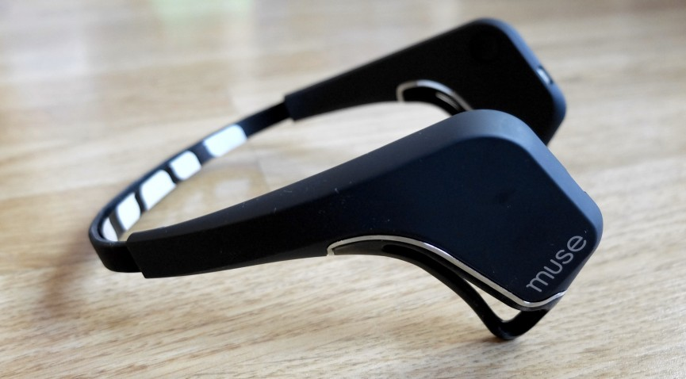

# Navigating your operating system through EOG signals

This application enables you to navigate your operating system using the Muse EEG headset via Bluetooth. Eye movements introduce artifacts to EEG signals. These can be reliably used to differentiate upward, downward, right and left eye movements. I developed a classifier that is able to recognize what direction your eyes are facing. So when running the application while wearing the Muse headset, you can make your operating system perform a "right", "left", "up" or "down" key press by looking in that direction. In addition to this, the classifier is able to recognize when you close your eyes. This command is used to make the operating system perform an "enter" key press. This way it is possible to open a file or folder.


<p align="center">
  
  <br>
  Muse EEG headset (Image Source: Wareable Ltd)
</p>

## Video Demonstration

A video demonstration is available. If interested, just contact me.


## Requirements

* The application runs on Linux
* It was tested using Python 3.8.5
* You need the Muse headset (version 2016)
* Dependencies: [Muse LSL](https://github.com/alexandrebarachant/muse-lsl), [PyLSL](https://github.com/chkothe/pylsl), [NumPy](https://numpy.org/), [PyAutoGUI](https://pyautogui.readthedocs.io/en/latest/), [PySoX](https://github.com/rabitt/pysox)
* Install dependencies by running ```pip install -r requirements.txt```

## Quickstart

* Establish a Bluetooth connection with the Muse headset by opening a terminal window and typing<br/> ```muselsl stream```
* Open a second terminal window
* When running the application for the first time, you need to calibrate your eye movements for the application to work (refer to section Calibration for specific details). Calibrate in the following order:
* First type ```python main.py calibrate resting``` to record EOG activity when eyes are at rest
* Then type ```python main.py calibrate right``` to calibrate the application for right eye movements
* Then type ```python main.py calibrate left``` to calibrate the application for left eye movements
* Then type ```python main.py calibrate upward``` to calibrate the application for upward eye movements
* Then type ```python main.py calibrate downward``` to calibrate the application for downward eye movements
* Run the application by typing ```python main.py run```

## How to navigate

There are two modes when running the application: Navigation Mode and Viewing Mode. Every time you start the application you are first in Viewing Mode. In this mode navigation is turned off and you can freely move your eyes around to read the content on your screen. When you are ready to navigate, you have to keep your eyes fixated for about two seconds and then look down and maintain your eyes in this position. A sequence of beeps will start playing for a couple of seconds to signal you that you are about to switch modes. A longer beep will signal you that you switched modes.

In Navigation Mode you can move your eyes in a specific direction to navigate in that direction. A beep will play to signal you that the command was executed. To direct the operating system to press "enter", close your eyes until a beep plays. Every time "enter" is pressed in this manner, Navigation Mode gets turned off and Viewing Mode becomes active.

Notes: 
* For the time that you are in Navigation Mode, you should only perform extreme eye movements or blink if you want to navigate, as the classifier will interpret these as commands. Viewing Mode serves the purpose of letting you freely blink and move your eyes again after navigating the operating system.
* When you are in Viewing Mode false positives can occur if you had your eyes in upward position for a period of time and then center them again, or for instance when you maintain your eyes in downward position without actually wanting to switch modes. If this happens, briefly look upwards before the beeper stops playing to prevent modes from switching.

## Calibration

* When calibrating eyes at rest you will have to keep your eyes open and fixated for a period of time (denoted by two beeps), so that EOG activity can be recorded. Then you will have time to relax your eyes and blink if you wish. This process will repeat 5 times
* When calibrating eyes for moving in vertical or horizontal direction, you will have to keep your eyes open and fixated after a first beep plays, then briefly look in specific direction after a second beep plays. After hearing a third beep you can relax your eyes and blink if you wish. This process will repeat 5 times.

Notes:
* If you were not able to properly follow the instructions during one of the 5 calibration sessions (resting, upward, downward, right, left), you can choose to immediately re-run the same calibration session and overwrite the previous result.
* If you wish to recalibrate entirely, you can follow the calibration instructions again from the beginning (see section Quickstart).

## Classification Algorithm

The classifier that I developed to be used by this application is partially based on this research paper: [1]. Similar to the approach taken there, I first remove baseline from the EEG signals coming from the Muse headset and then smooth the signals using least squares polynomial approximation. 

Generally in EEG experiments, movement of the eyes introduces deflections to the signal. These deflections differ depending on the type of eye movement that is performed. The authors in [1] propose to use these deflections as features to be used by a classifier to differentiate upward, downward, right and left eye movements. They compute the surface areas of the deflections and detect eye movements when specific thresholds are exceeded. I took the same approach, but worked with fewer electrodes than the authors, as the Muse headset only uses 4 electrodes. 

For detecting eye closure and identifying whether eyes are kept in downward position during Viewing Mode, I had to come up with additional criteria for differentiation. To do this, I ran a number of experiments while visually inspecting the EOG signals. I then came up with additional time-dependent criteria that I used for this task.

## References
[1]</a> 
Belkacem, A. N., Hirose, H., Yoshimura, N., Shin, D., & Koike, Y. (2014). 
Classification of four eye directions from EEG signals for eye-movement-based communication systems. 
life, 1, 3.
